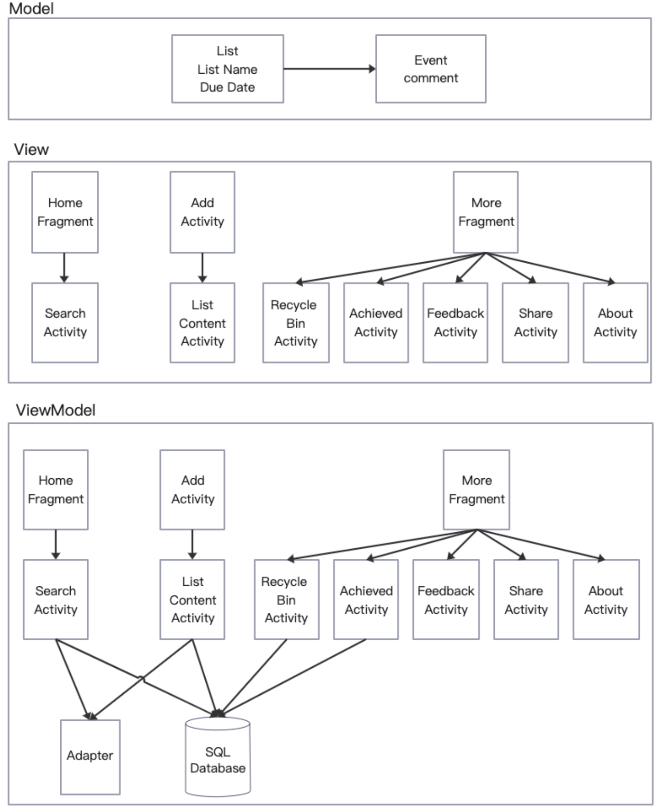

# WooHooSchedule-APP
WooHooSchedule APP for the SFU-CMPT362 Group Project, this is a super easy app for user to check Todo event

# Abstract
1. Easy for daily schedule 
2. Track scheduled events 
3. Visual completion (Completion for todo list)
4. A solid base for adding creative extensions
5. Data visualization (deadline date, #of completed and rest)
6. Free app without any advertisements and costs!

# MVVM diagram

# What we did 
1. Create an initialized Schedule List
2. Create a title and deadline when add a list
3. Can add any number of events to the list
4. Can delete list and achieve (Here delete is not delete directly, but to the recycle bin, and the recycle bin has not finished)
5. When an item in the list is completed, you can click ⭕ on the left to indicate completion, and click again to cancel
6. In the homepage, you can see the completion of each list. When all tips in a list are complete, green "√" is displayed. If the deadline is exceeded, a red "!" will appear
7. Includes the function of recycling bins in "More"(To be continued)
8. The data will be stored locally, it could be private
9. The button and color we used is from https://github.com/dmytrodanylyk/shadow-layout

## Basic use to create Todo

## Three cases of the Todo list show in homepage

# What's left 
1. Recycle bin in "More" page for user that have chances to undo the deletion
2. On the Home page, tap and hold the list to confirm the deletion
3. For each event, tap and hold the list to confirm the deletion
4. Search function 🔍 on the right tab of the homepage, we will continue to implement this function that for searching the list with out entire list name
5. FeedBack in "More" page will be used to link to email 
6. Share app in "More" page will be used to share this app's apk 
7. About WooHoo app in "More" page will be used to show the version of this app 

# Contributor
1. Weilong Xu
2. Handa Huang
3. Junchen Li
4. Siwei Wang
5. Haojie Huang

